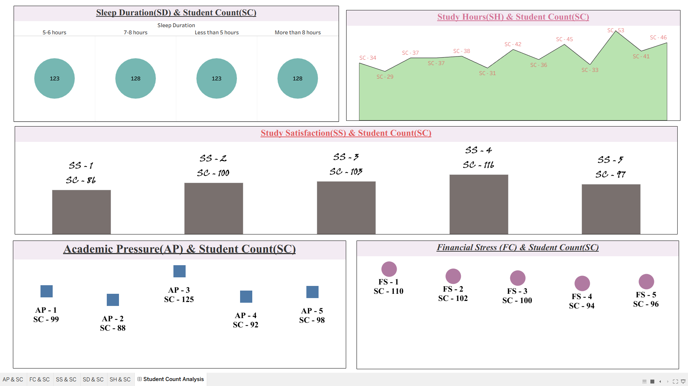
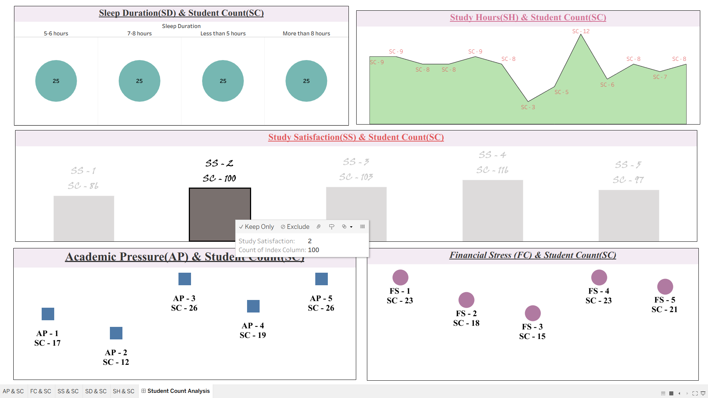
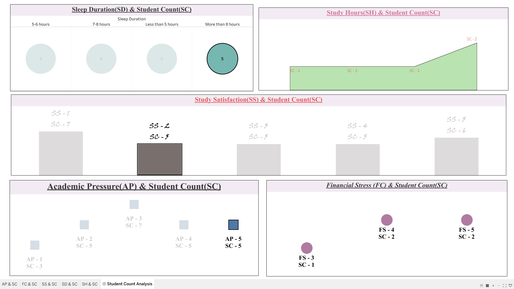

# 🎓 Student Depression Data Analysis

This project analyzes mental health trends among students, focusing on identifying key factors that correlate with depression. The analysis was conducted using SQL for data processing and Tableau for creating an interactive, insightful dashboard.

## 🎯 Goal

The primary objective is to identify and visualize the key factors contributing to student depression, such as academic pressure, sleep duration, and financial stress. The final output is a user-friendly dashboard that allows for dynamic exploration of the data to derive meaningful insights.

## 🛠️ Tech Stack

* **Database:** SQL Server
* **Data Visualization:** Tableau
* **Dataset:** `updated_student_depression_data.csv`

## 📊 Dashboard Preview

The final dashboard provides a comprehensive overview of several key metrics related to student well-being.

### 🧠 Final Dashboard Overview

The dashboard visualizes the following relationships:
- **Sleep Duration ($SD$) vs Student Count ($SC$)**
- **Study Hours ($SH$) vs Student Count ($SC$)**
- **Study Satisfaction ($SS$) vs Student Count ($SC$)**
- **Academic Pressure ($AP$) vs Student Count ($SC$)**
- **Financial Stress ($FC$) vs Student Count ($SC$)**

### 🔄 Interactive Filtering in Action

The dashboard is fully interactive. Clicking on any data point on a chart will filter the entire dashboard, allowing for a granular analysis of how different factors are correlated.

| **Example 1: Filtering by Study Satisfaction** | **Example 2: Filtering by Sleep Duration** |
| :---: | :---: |
|  |  |

## 💡 Key Insights

The analysis yielded several key findings:

* **Academic Pressure:** The most commonly reported level of academic pressure is moderate (`AP-3`), suggesting this is a significant stressor for the largest group of students.
* **Study Satisfaction:** Satisfaction peaks at a level of 4 out of 5, indicating that while most students are generally satisfied, there is still room for improvement in their academic experience.
* **Sleep Patterns:** There is no single dominant sleep pattern. Students are almost evenly distributed across all categories, from getting less than 5 hours to more than 8 hours of sleep, highlighting diverse lifestyle habits.
* **Financial Stress:** While the lowest level of financial stress (`FS-1`) is the most common, a significant number of students still report experiencing higher levels, indicating that financial concerns remain prevalent.

## 📁 Repository Files

* `Depression I Student - Dataset.csv`: The initial raw dataset.
* `updated_student_depression_data.csv`: The cleaned and preprocessed dataset used for the analysis.
* `depression_analysis_queries.sql`: Contains all the SQL queries used for data cleaning, transformation, and analysis.
* `SQL+Tableau Project.pdf`: A detailed report document outlining the project's lifecycle and findings.
* `final.png`, `interactive1.png`, `interactive2.png`: Image assets of the dashboard and its interactive features.

## 🚀 How to Replicate

To replicate this analysis, follow these steps:

1.  **Database:** Execute the queries in `depression_analysis_queries.sql` on a SQL Server instance using the `Depression I Student - Dataset.csv` as the input table.
2.  **Export Data:** The SQL script will produce the cleaned data. Export this as `updated_student_depression_data.csv`.
3.  **Visualize:** Open the project's Tableau workbook (`.twbx` file) and connect it to the `updated_student_depression_data.csv` to interact with the dashboard.
